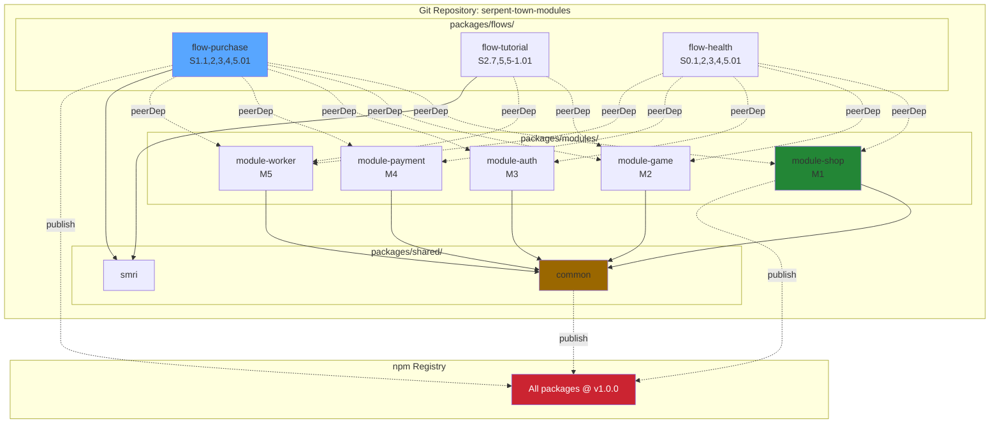

# 🔬 Flow-Based Modular Architecture - Deep Research

**Research Date:** 2026-01-20  
**Version:** 1.0  
**Use Case:** Extract SMRI flows as reusable npm packages with zero duplication

---

## 📋 Table of Contents
1. [Problem Statement](#problem-statement)
2. [Architecture Comparison](#architecture-comparison)
3. [Recommended Solution](#recommended-solution)
4. [Implementation Guide](#implementation-guide)
5. [Version Management](#version-management)
6. [Practical Example](#practical-example)
7. [Migration Path](#migration-path)

---

## 🎯 Problem Statement

### Current State
```
Serpent Town (Monolith)
├── src/
│   ├── modules/
│   │   ├── shop/       (M1)
│   │   ├── game/       (M2)
│   │   ├── auth/       (M3)
│   │   ├── payment/    (M4)
│   │   └── worker/     (M5)
└── Flows are embedded in code
```

### Desired State
```
Other Project
└── node_modules/
    └── @serpent-town/
        ├── flow-purchase/     ← S1.1,2,3,4,5.01 (facade)
        ├── module-shop/       ← M1 (shared, single version)
        ├── module-game/       ← M2 (shared, single version)
        ├── module-auth/       ← M3 (shared, single version)
        ├── module-payment/    ← M4 (shared, single version)
        └── module-worker/     ← M5 (shared, single version)
                                  ↑ NO DUPLICATION!
```

### Requirements
✅ Flow packages are facades only (lightweight)  
✅ Modules are shared via `node_modules` (zero duplication)  
✅ All versions synchronized (1.0.0 everywhere)  
✅ System-wide version bump on any change  
✅ Easy to use in any project  
✅ Standard npm/Node.js compatible  

---

## 🏗️ Architecture Comparison

### Option 1: Monorepo + Peer Dependencies ⭐ **RECOMMENDED**

**Structure:**
```
serpent-town-modules/                    # Single Git repo
├── packages/
│   ├── flows/
│   │   ├── purchase/                    # @serpent-town/flow-purchase
│   │   ├── tutorial/                    # @serpent-town/flow-tutorial
│   │   └── health/                      # @serpent-town/flow-health
│   ├── modules/
│   │   ├── shop/                        # @serpent-town/module-shop
│   │   ├── game/                        # @serpent-town/module-game
│   │   ├── auth/                        # @serpent-town/module-auth
│   │   ├── payment/                     # @serpent-town/module-payment
│   │   └── worker/                      # @serpent-town/module-worker
│   └── shared/
│       ├── common/                      # @serpent-town/common
│       └── smri/                        # @serpent-town/smri
├── lerna.json                           # Version: 1.0.0 (all packages)
├── package.json                         # Workspace root
└── tools/
    └── version-sync.js                  # Ensures version consistency
```

**Why This Works:**

1. **Zero Duplication via Peer Dependencies**
```json
// @serpent-town/flow-purchase/package.json
{
  "name": "@serpent-town/flow-purchase",
  "version": "1.0.0",
  "peerDependencies": {
    "@serpent-town/module-shop": "1.0.0",      // Exact version!
    "@serpent-town/module-game": "1.0.0",
    "@serpent-town/module-auth": "1.0.0",
    "@serpent-town/module-payment": "1.0.0",
    "@serpent-town/module-worker": "1.0.0"
  }
}
```

2. **Consumer Installs Once**
```bash
npm install @serpent-town/flow-purchase
# npm 7+ auto-installs peer dependencies
```

Result:
```
node_modules/
└── @serpent-town/
    ├── flow-purchase/          (5 KB - facade only)
    ├── module-shop/            (200 KB)
    ├── module-game/            (150 KB)
    ├── module-auth/            (100 KB)
    ├── module-payment/         (180 KB)
    └── module-worker/          (220 KB)
    
Total: ~855 KB (no duplication!)
```

3. **System-Wide Version Bump**
```bash
# Change ANY file in ANY package
lerna version patch --force-publish

# Result: ALL packages go 1.0.0 → 1.0.1
```

---

### Option 2: Separate Repos + Registry

**Structure:**
```
GitHub:
├── serpent-town-flow-purchase/
├── serpent-town-flow-tutorial/
├── serpent-town-module-shop/
├── serpent-town-module-game/
└── ...

npm registry:
└── @serpent-town/
    ├── flow-purchase@1.0.0
    ├── module-shop@1.0.0
    └── ...
```

**Pros:**
- Independent CI/CD per package
- Granular access control
- Smaller repos

**Cons:**
- ❌ Hard to maintain version sync
- ❌ Complex cross-repo changes
- ❌ No atomic commits
- ❌ Manual version coordination

**Verdict:** ❌ Not recommended for synchronized versioning

---

### Option 3: Bundled Flows

**Structure:**
```
@serpent-town/flow-purchase/
├── dist/
│   └── bundle.js           # ALL dependencies bundled (3 MB!)
└── package.json
```

**Pros:**
- Single install
- Self-contained

**Cons:**
- ❌ MASSIVE duplication
- ❌ 3 MB per flow × 10 flows = 30 MB!
- ❌ Update requires republishing all flows

**Verdict:** ❌ Defeats the purpose

---

## ⭐ Recommended Solution: Monorepo + Lerna + Peer Deps

### Architecture Diagram



### Key Principles

1. **Single Source of Truth**
   - All code in one Git repo
   - One version number for entire system
   - One commit = one deploy

2. **Facade Pattern for Flows**
   - Flow packages are thin wrappers
   - No business logic in flows
   - Just import + re-export modules

3. **Peer Dependencies for Sharing**
   - Modules never bundled in flows
   - Host project installs once
   - No duplication possible

4. **Exact Version Pinning**
   - Use `"1.0.0"` not `"^1.0.0"`
   - Ensures all packages are same version
   - Prevents version drift

---

## 🔧 Implementation Guide

### Step 1: Create Monorepo Structure

```bash
# Create new repo
mkdir serpent-town-modules
cd serpent-town-modules
git init

# Initialize npm workspace
npm init -y
npm pkg set name="serpent-town-modules"
npm pkg set private=true
npm pkg set workspaces[]="packages/*"

# Install Lerna
npm install -D lerna

# Initialize Lerna with fixed versioning
npx lerna init
```

**lerna.json:**
```json
{
  "version": "1.0.0",
  "npmClient": "npm",
  "useWorkspaces": true,
  "packages": ["packages/*"],
  "command": {
    "version": {
      "forcePublish": true,
      "exact": true,
      "conventionalCommits": true,
      "message": "chore(release): publish v%s",
      "createRelease": "github"
    },
    "publish": {
      "registry": "https://registry.npmjs.org",
      "message": "chore(release): publish v%s"
    }
  }
}
```

### Step 2: Extract Modules

```bash
# Create module structure
mkdir -p packages/modules/{shop,game,auth,payment,worker}
mkdir -p packages/flows
mkdir -p packages/shared/{common,smri}

# Create shop module
cd packages/modules/shop
npm init -y
npm pkg set name="@serpent-town/module-shop"
npm pkg set version="1.0.0"
npm pkg set main="dist/index.js"
npm pkg set module="dist/index.esm.js"
npm pkg set types="dist/index.d.ts"
npm pkg set smri.module=1
npm pkg set smri.name="Shop"
npm pkg set files[]="dist"
```

**packages/modules/shop/package.json:**
```json
{
  "name": "@serpent-town/module-shop",
  "version": "1.0.0",
  "description": "Shop module for Serpent Town (M1)",
  "main": "dist/index.js",
  "module": "dist/index.esm.js",
  "types": "dist/index.d.ts",
  "files": ["dist"],
  "smri": {
    "module": 1,
    "name": "Shop",
    "description": "Product catalog and checkout"
  },
  "scripts": {
    "build": "rollup -c",
    "test": "jest"
  },
  "dependencies": {
    "@serpent-town/common": "1.0.0"
  },
  "publishConfig": {
    "access": "public"
  }
}
```

**packages/modules/shop/src/index.js:**
```javascript
/**
 * Shop Module (M1)
 * SMRI: S1.x
 * 
 * Provides:
 * - Product catalog display
 * - Filtering and search
 * - Product detail views
 * - Checkout initiation
 */

export { ShopUI } from './ShopUI.js';
export { ProductCatalog } from './ProductCatalog.js';
export { ProductDetail } from './ProductDetail.js';
export { CheckoutInitiator } from './CheckoutInitiator.js';

export const MODULE_INFO = {
  id: 1,
  name: 'Shop',
  version: '1.0.0',
  smri: 'S1'
};
```

### Step 3: Create Flow Facades

```bash
cd packages/flows
mkdir purchase
cd purchase
npm init -y
npm pkg set name="@serpent-town/flow-purchase"
npm pkg set version="1.0.0"
npm pkg set main="dist/index.js"
npm pkg set smri="S1.1,2,3,4,5.01"
```

**packages/flows/purchase/package.json:**
```json
{
  "name": "@serpent-town/flow-purchase",
  "version": "1.0.0",
  "description": "Happy Path Purchase Flow (S1.1,2,3,4,5.01)",
  "main": "dist/index.js",
  "module": "dist/index.esm.js",
  "types": "dist/index.d.ts",
  "files": ["dist"],
  "smri": {
    "code": "S1.1,2,3,4,5.01",
    "name": "Happy Path Purchase",
    "modules": [1, 2, 3, 4, 5],
    "description": "Complete purchase flow from catalog to game"
  },
  "scripts": {
    "build": "rollup -c",
    "test": "jest"
  },
  "peerDependencies": {
    "@serpent-town/module-shop": "1.0.0",
    "@serpent-town/module-game": "1.0.0",
    "@serpent-town/module-auth": "1.0.0",
    "@serpent-town/module-payment": "1.0.0",
    "@serpent-town/module-worker": "1.0.0"
  },
  "dependencies": {
    "@serpent-town/smri": "1.0.0"
  },
  "publishConfig": {
    "access": "public"
  }
}
```

**packages/flows/purchase/src/index.js:**
```javascript
/**
 * Purchase Flow Facade
 * SMRI: S1.1,2,3,4,5.01
 * 
 * Orchestrates modules: Shop → Auth → Payment → Worker → Game
 */

import { ShopUI, ProductCatalog } from '@serpent-town/module-shop';
import { GameController } from '@serpent-town/module-game';
import { AuthManager } from '@serpent-town/module-auth';
import { PaymentProcessor } from '@serpent-town/module-payment';
import { WorkerClient } from '@serpent-town/module-worker';

export class PurchaseFlow {
  constructor(config = {}) {
    this.config = config;
    this.smri = 'S1.1,2,3,4,5.01';
    
    // Initialize modules
    this.shop = new ShopUI(config.shopConfig);
    this.auth = new AuthManager(config.authConfig);
    this.payment = new PaymentProcessor(config.paymentConfig);
    this.worker = new WorkerClient(config.workerUrl);
    this.game = new GameController(config.gameConfig);
  }

  /**
   * Execute the full purchase flow
   */
  async execute() {
    // M1: Display catalog
    await this.shop.displayCatalog();
    const product = await this.shop.selectProduct();
    
    // M3: Authenticate user
    const user = await this.auth.getOrCreateUser();
    
    // M4: Process payment
    const session = await this.payment.createSession({
      product,
      user
    });
    await this.payment.redirectToCheckout(session);
    
    // M5: Worker handles webhook (server-side)
    // ... payment completes ...
    
    // M2: Initialize game
    await this.game.assignSnakeToFarm(product, user);
    
    return { success: true, user, product };
  }

  /**
   * Get flow metadata
   */
  static getMetadata() {
    return {
      smri: 'S1.1,2,3,4,5.01',
      name: 'Happy Path Purchase',
      modules: {
        shop: 1,
        game: 2,
        auth: 3,
        payment: 4,
        worker: 5
      },
      steps: 13,
      estimatedTime: 1600 // ms
    };
  }
}

// Re-export modules for direct access
export { ShopUI, ProductCatalog } from '@serpent-town/module-shop';
export { GameController } from '@serpent-town/module-game';
export { AuthManager } from '@serpent-town/module-auth';
export { PaymentProcessor } from '@serpent-town/module-payment';
export { WorkerClient } from '@serpent-town/module-worker';

// Export metadata
export const SMRI = 'S1.1,2,3,4,5.01';
export const metadata = PurchaseFlow.getMetadata();
```

### Step 4: Build Configuration

**packages/modules/shop/rollup.config.js:**
```javascript
import resolve from '@rollup/plugin-node-resolve';
import commonjs from '@rollup/plugin-commonjs';
import { terser } from 'rollup-plugin-terser';

export default {
  input: 'src/index.js',
  output: [
    {
      file: 'dist/index.js',
      format: 'cjs',
      exports: 'named'
    },
    {
      file: 'dist/index.esm.js',
      format: 'esm'
    }
  ],
  plugins: [
    resolve(),
    commonjs(),
    terser()
  ],
  external: [
    '@serpent-town/common'
  ]
};
```

### Step 5: Version Management Script

**tools/version-sync.js:**
```javascript
#!/usr/bin/env node
import fs from 'fs';
import path from 'path';
import { glob } from 'glob';

/**
 * Ensures all packages have exact version dependencies
 * Run before publishing
 */

const VERSION = process.argv[2] || '1.0.0';

async function syncVersions() {
  const packages = await glob('packages/**/package.json', {
    ignore: ['**/node_modules/**']
  });

  for (const pkgPath of packages) {
    const pkg = JSON.parse(fs.readFileSync(pkgPath, 'utf8'));
    
    // Update version
    pkg.version = VERSION;
    
    // Update dependencies to exact versions
    if (pkg.dependencies) {
      for (const dep in pkg.dependencies) {
        if (dep.startsWith('@serpent-town/')) {
          pkg.dependencies[dep] = VERSION;
        }
      }
    }
    
    // Update peerDependencies to exact versions
    if (pkg.peerDependencies) {
      for (const dep in pkg.peerDependencies) {
        if (dep.startsWith('@serpent-town/')) {
          pkg.peerDependencies[dep] = VERSION;
        }
      }
    }
    
    fs.writeFileSync(pkgPath, JSON.stringify(pkg, null, 2) + '\n');
    console.log(`✅ ${pkg.name}@${VERSION}`);
  }
  
  console.log(`\n🎉 All packages synced to v${VERSION}`);
}

syncVersions().catch(console.error);
```

**package.json scripts:**
```json
{
  "scripts": {
    "build": "lerna run build",
    "test": "lerna run test",
    "version:sync": "node tools/version-sync.js",
    "version:patch": "lerna version patch --force-publish && npm run version:sync",
    "version:minor": "lerna version minor --force-publish && npm run version:sync",
    "version:major": "lerna version major --force-publish && npm run version:sync",
    "publish": "lerna publish from-package"
  }
}
```

---

## 🔄 Version Management Workflow

### Scenario: Fix Bug in Shop Module

```bash
# 1. Make changes
vim packages/modules/shop/src/ProductCatalog.js

# 2. Commit
git add .
git commit -m "fix(shop): product filter bug"

# 3. Version bump (ALL packages)
npm run version:patch
# 1.0.0 → 1.0.1 for ALL packages

# 4. Build all
npm run build

# 5. Publish all
npm run publish

# Result:
# @serpent-town/module-shop@1.0.1
# @serpent-town/flow-purchase@1.0.1  (even though unchanged)
# ... all packages @1.0.1
```

### Why Force Publish All?

**Without Force Publish:**
```
module-shop: 1.0.0 → 1.0.1 (changed)
flow-purchase: 1.0.0 (unchanged)
  └─ peerDep: module-shop@1.0.0  ❌ WRONG VERSION!
```

**With Force Publish:**
```
module-shop: 1.0.0 → 1.0.1
flow-purchase: 1.0.0 → 1.0.1
  └─ peerDep: module-shop@1.0.1  ✅ CORRECT!
```

---

## 💡 Practical Example: Using in Another Project

### Installation

```bash
# New project
mkdir my-snake-shop
cd my-snake-shop
npm init -y

# Install flow (auto-installs peer dependencies)
npm install @serpent-town/flow-purchase
```

**Result:**
```
node_modules/
└── @serpent-town/
    ├── flow-purchase@1.0.1          (10 KB)
    ├── module-shop@1.0.1            (200 KB)
    ├── module-game@1.0.1            (150 KB)
    ├── module-auth@1.0.1            (100 KB)
    ├── module-payment@1.0.1         (180 KB)
    ├── module-worker@1.0.1          (220 KB)
    ├── common@1.0.1                 (50 KB)
    └── smri@1.0.1                   (20 KB)

Total: ~930 KB (all modules, no duplication!)
```

### Usage in Code

```javascript
// src/index.js
import { PurchaseFlow, SMRI, metadata } from '@serpent-town/flow-purchase';

console.log('Using flow:', SMRI);           // S1.1,2,3,4,5.01
console.log('Version:', metadata.version);   // 1.0.1
console.log('Modules:', metadata.modules);   // {shop: 1, game: 2, ...}

// Initialize
const flow = new PurchaseFlow({
  shopConfig: {
    apiUrl: 'https://api.my-shop.com'
  },
  paymentConfig: {
    stripeKey: 'pk_test_...'
  },
  workerUrl: 'https://worker.my-shop.com'
});

// Execute
await flow.execute();
```

### Using Multiple Flows

```bash
# Install multiple flows
npm install @serpent-town/flow-purchase
npm install @serpent-town/flow-tutorial
```

**Result:**
```
node_modules/
└── @serpent-town/
    ├── flow-purchase@1.0.1          (10 KB)
    ├── flow-tutorial@1.0.1          (8 KB)
    ├── module-shop@1.0.1            (200 KB) ← Shared!
    ├── module-game@1.0.1            (150 KB) ← Shared!
    ├── module-auth@1.0.1            (100 KB)
    ├── module-payment@1.0.1         (180 KB)
    └── module-worker@1.0.1          (220 KB) ← Shared!

Total: ~868 KB (modules shared between flows!)
```

No duplication because:
- `flow-purchase` depends on M1,M2,M3,M4,M5
- `flow-tutorial` depends on M2,M5
- **M2 and M5 installed once, shared by both flows**

---

## 🚀 Migration Path from Current Codebase

### Phase 1: Setup (Week 1)

```bash
# Create monorepo
mkdir serpent-town-modules
cd serpent-town-modules
npm init -y
npm install -D lerna

# Copy existing code
cp -r /root/catalog/src/modules/* packages/modules/
cp -r /root/catalog/src/components/* packages/shared/common/
```

### Phase 2: Extract Modules (Week 2-3)

For each module:
1. Create package.json
2. Add rollup build
3. Define exports
4. Add tests
5. Build & verify

### Phase 3: Create Flow Facades (Week 4)

For each SMRI flow:
1. Create flow package
2. Define peerDependencies
3. Write facade code
4. Add metadata
5. Build & test

### Phase 4: Publish (Week 5)

```bash
# Login to npm
npm login

# First publish (all packages)
lerna publish --force-publish

# Verify
npm info @serpent-town/flow-purchase
```

### Phase 5: Update Original Project (Week 6)

```bash
cd /root/catalog

# Remove src/modules/
rm -rf src/modules

# Install from npm
npm install @serpent-town/flow-purchase
npm install @serpent-town/flow-tutorial

# Update imports
# Before: import { Shop } from './modules/shop'
# After:  import { Shop } from '@serpent-town/module-shop'
```

---

## 📊 Comparison Matrix

| Feature | Current Monolith | Monorepo + Peer Deps | Separate Repos | Bundled Flows |
|---------|------------------|---------------------|----------------|---------------|
| **Reusability** | ❌ Hard | ✅ Easy | ✅ Easy | ✅ Easy |
| **No Duplication** | ✅ Yes | ✅ Yes | ✅ Yes | ❌ No |
| **Version Sync** | ✅ Automatic | ✅ Automatic | ❌ Manual | ⚠️ Manual |
| **System-Wide Tag** | N/A | ✅ Yes | ❌ No | ❌ No |
| **Atomic Changes** | ✅ Yes | ✅ Yes | ❌ No | ⚠️ Partial |
| **Easy to Use** | N/A | ✅ npm install | ✅ npm install | ✅ npm install |
| **Bundle Size** | N/A | ✅ Small | ✅ Small | ❌ Large |
| **CI/CD** | Simple | ⚠️ Complex | Simple | Simple |

**Winner:** Monorepo + Peer Dependencies ✅

---

## 🎯 Benefits of This Approach

### For You (Developer)
- ✅ Extract flows to other projects easily
- ✅ One version number for entire system
- ✅ No dependency hell
- ✅ Atomic commits and releases
- ✅ Single source of truth

### For Consumers
- ✅ `npm install @serpent-town/flow-purchase` just works
- ✅ No duplication in node_modules
- ✅ All versions guaranteed compatible
- ✅ Tree-shakeable (ES modules)
- ✅ TypeScript definitions included

### For System
- ✅ Enforced consistency
- ✅ Easy dependency tracking
- ✅ Clear module boundaries
- ✅ Testable in isolation
- ✅ Documented via SMRI codes

---

## 🔐 Version Consistency Guarantees

### Tool: Version Validator

**tools/validate-versions.js:**
```javascript
#!/usr/bin/env node
import { glob } from 'glob';
import fs from 'fs';

async function validate() {
  const packages = await glob('packages/**/package.json', {
    ignore: ['**/node_modules/**']
  });

  const versions = new Map();
  let errors = 0;

  for (const pkgPath of packages) {
    const pkg = JSON.parse(fs.readFileSync(pkgPath, 'utf8'));
    
    // Check main version
    if (!versions.has('main')) {
      versions.set('main', pkg.version);
    } else if (versions.get('main') !== pkg.version) {
      console.error(`❌ ${pkg.name}: version ${pkg.version} !== ${versions.get('main')}`);
      errors++;
    }
    
    // Check dependencies
    const allDeps = {
      ...pkg.dependencies,
      ...pkg.peerDependencies
    };
    
    for (const [dep, ver] of Object.entries(allDeps)) {
      if (dep.startsWith('@serpent-town/')) {
        if (ver !== versions.get('main')) {
          console.error(`❌ ${pkg.name} depends on ${dep}@${ver} (should be ${versions.get('main')})`);
          errors++;
        }
      }
    }
  }

  if (errors === 0) {
    console.log(`✅ All ${packages.length} packages at v${versions.get('main')}`);
    process.exit(0);
  } else {
    console.error(`\n❌ ${errors} version inconsistencies found`);
    process.exit(1);
  }
}

validate().catch(console.error);
```

**Run in CI:**
```yaml
# .github/workflows/validate.yml
name: Validate Versions
on: [push, pull_request]
jobs:
  validate:
    runs-on: ubuntu-latest
    steps:
      - uses: actions/checkout@v3
      - uses: actions/setup-node@v3
      - run: npm ci
      - run: node tools/validate-versions.js
```

---

## 📚 Further Reading

- **Lerna:** https://lerna.js.org/
- **npm Workspaces:** https://docs.npmjs.com/cli/v8/using-npm/workspaces
- **Peer Dependencies:** https://nodejs.org/en/blog/npm/peer-dependencies
- **Monorepo Tools:** https://monorepo.tools/
- **SMRI System:** `.smri/docs/SMRI-REFERENCE.md`

---

## ✅ Summary

**Best Approach:** Monorepo + Lerna + Peer Dependencies

**Key Points:**
1. One Git repo, many npm packages
2. Flows are facades (lightweight)
3. Modules are shared via peer dependencies
4. All packages have same version
5. System-wide version bumps
6. Zero duplication in node_modules
7. Easy to use: `npm install @serpent-town/flow-purchase`

**Next Steps:**
1. Create `serpent-town-modules` repo
2. Extract modules (M1-M5)
3. Create flow facades (S1.x, S2.x, etc.)
4. Set up Lerna with fixed versioning
5. Publish to npm
6. Update original project to consume

**Estimated Effort:** 4-6 weeks for full migration

---

**Document Version:** 1.0  
**Last Updated:** 2026-01-20  
**Author:** AI Assistant  
**Related:** `.smri/docs/PURCHASE-FLOW-DEPENDENCY-GRAPH.md`
