# 📊 Purchase Flow Dependency Graph

**SMRI:** `S1.1,2,3,4,5.01` (Happy Path Purchase)  
**Version:** 0.7.46  
**Last Updated:** 2026-01-20

---

## 🎯 Visual Flow

```mermaid
graph TB
    Start[🛒 Customer Visits Shop] --> M1

    subgraph M1_Group["M1: Shop Module"]
        M1[Display Catalog]
        M1_filter[Filter by Species/Morph]
        M1_select[Select Snake]
        M1_details[View Product Details]
        M1 --> M1_filter --> M1_select --> M1_details
    end

    M1_details --> M3_check

    subgraph M3_Group["M3: Auth Module"]
        M3_check{User Authenticated?}
        M3_anon[Anonymous Mode]
        M3_hash[Generate/Retrieve Hash]
        M3_check -->|No| M3_anon --> M3_hash
        M3_check -->|Yes| M3_hash
    end

    M3_hash --> M4

    subgraph M4_Group["M4: Payment Module"]
        M4[Create Stripe Session]
        M4_redirect[Redirect to Checkout]
        M4_pay[💳 Customer Pays]
        M4 --> M4_redirect --> M4_pay
    end

    M4_pay --> M5_webhook

    subgraph M5_Group["M5: Worker Module"]
        M5_webhook[📨 Receive Webhook]
        M5_verify[🔐 Verify Signature]
        M5_process[Process Payment]
        M5_kv[💾 Save to KV]
        M5_update[Update Product Status]
        M5_webhook --> M5_verify --> M5_process --> M5_kv --> M5_update
    end

    M5_update --> External

    subgraph External["External Services"]
        KV[(Cloudflare KV)]
        Stripe[Stripe API]
    end

    M4 -.->|API Call| Stripe
    M5_webhook -.->|Webhook| Stripe
    M5_kv --> KV

    M5_update --> M1_success

    subgraph M1_Return["M1: Shop Module (Success)"]
        M1_success[✅ Success Page]
        M1_receipt[Show Receipt]
        M1_success --> M1_receipt
    end

    M1_receipt --> M2

    subgraph M2_Group["M2: Game Module"]
        M2[🐍 Assign to Farm]
        M2_init[Initialize Stats]
        M2_save[💾 Save Game State]
        M2 --> M2_init --> M2_save
    end

    M2_save --> KV
    M2_save --> End[🎉 Complete!]

    style Start fill:#58a6ff,stroke:#1f6feb,color:#fff,stroke-width:3px
    style End fill:#238636,stroke:#1a7f37,color:#fff,stroke-width:3px
    style M3_check fill:#d29922,stroke:#9a6700,stroke-width:2px
    style M4_pay fill:#635bff,stroke:#0a2540,color:#fff,stroke-width:2px
    style KV fill:#8957e5,stroke:#6e40c9,color:#fff
    style Stripe fill:#635bff,stroke:#0a2540,color:#fff
```



---

## 🔗 Module Dependencies

### Primary Flow
```
M1 (Shop) → M3 (Auth) → M4 (Payment) → M5 (Worker) → M2 (Game)
```

### External Dependencies
```
M4 (Payment) ──API──> Stripe
M5 (Worker)  <──Webhook── Stripe  
M5 (Worker)  ──Store──> Cloudflare KV
M2 (Game)    ──Load/Save──> Cloudflare KV
```

---

## 📋 Detailed Step Breakdown

| # | Module | Action | Dependencies | Time |
|---|--------|--------|--------------|------|
| 1 | M1 Shop | Display catalog | - | ~200ms |
| 2 | M1 Shop | Filter products (species/morph) | - | ~50ms |
| 3 | M1 Shop | Select snake, view details | - | User action |
| 4 | M3 Auth | Check authentication | localStorage | ~10ms |
| 5 | M3 Auth | Generate/retrieve user hash | - | ~5ms |
| 6 | M4 Payment | Create Stripe checkout session | Stripe API | ~300ms |
| 7 | M4 Payment | Redirect to Stripe | Stripe Hosted | ~500ms |
| 8 | M4 Payment | Customer completes payment | Stripe | User action |
| 9 | M5 Worker | Receive webhook from Stripe | Stripe → Worker | ~50ms |
| 10 | M5 Worker | Verify webhook signature | - | ~10ms |
| 11 | M5 Worker | Process payment confirmation | - | ~20ms |
| 12 | M5 Worker | Save purchase to KV | Cloudflare KV | ~100ms |
| 13 | M5 Worker | Update product status | Cloudflare KV | ~50ms |
| 14 | M1 Shop | Redirect to success page | - | ~100ms |
| 15 | M1 Shop | Show receipt & details | KV (read) | ~100ms |
| 16 | M2 Game | Assign snake to user's farm | - | ~20ms |
| 17 | M2 Game | Initialize snake stats | - | ~10ms |
| 18 | M2 Game | Save game state to KV | Cloudflare KV | ~100ms |

**Total Time:** ~1.6s (excluding user actions)

---

## 🔍 Critical Paths & Error Scenarios

### ✅ Happy Path (All Success)
```
Shop → Auth → Stripe API → Payment → Webhook → KV Save → Success → Game
```

### ❌ Error Scenarios

**Payment Failed:**
```
Shop → Auth → Stripe API → [❌ Payment Declined] → Back to Shop
SMRI: S4.4.02 (Refund Check)
```

**Webhook Failed:**
```
Shop → Auth → Stripe → Payment → [❌ Webhook Timeout] → Retry
SMRI: S4.4,5-2.02 (Webhook Failure)
Action: Automatic retry 3x, then manual reconciliation
```

**KV Storage Failed:**
```
Shop → Auth → Stripe → Payment → Webhook → [❌ KV Error] → Error Page
SMRI: S5.5.02 (Error Recovery)
Action: Log error, notify support, provide manual order ID
```

**Duplicate Purchase:**
```
Shop → Auth → Stripe → Payment → Webhook → [⚠️ Already Processed] → Idempotency Check
SMRI: S4.4,5-2.03 (Idempotency)
Action: Return success without duplicate processing
```

---

## 📊 Related SMRI Codes

| SMRI Code | Registry Key | Description | Modules |
|-----------|--------------|-------------|---------|
| **S1.1,2,3,4,5.01** | `happy-path-purchase` | ⭐ **Main Flow** | 1,2,3,4,5 |
| S1.1,2,3,4.01 | `returning-user-purchase` | Returning customer | 1,2,3,4 |
| S1.1.01 | `product-availability` | Check product status | 1 |
| S1.1,2.02 | `buy-five-snakes` | Multiple purchases | 1,2 |
| S4.4,5.01 | `stripe-session` | Create checkout | 4,5 |
| S4.4,5-2.01 | `webhook-success` | Webhook handling | 4,5+Stripe |
| S4.4,5-2.02 | `webhook-failure` | Webhook retry | 4,5+Stripe |
| S4.4,5-2.03 | `idempotency` | Duplicate prevention | 4,5+Stripe |
| S5.3,5-1.01 | `user-save` | Save user to KV | 5+KV |
| S5.5,5-1.01 | `products-endpoint` | Product API | 5+KV |
| S2.2.01 | `stats-display` | View snake stats | 2 |
| S2.5,5-1.01 | `auto-save` | Game auto-save | 2,5+KV |

---

## 🎯 SMRI Code Format

```
S{M}.{RRR}.{II}
 │   │     └── Iteration (01-99)
 │   └──────── Relations/Dependencies (comma-separated)
 └──────────── Primary Module

Example: S1.1,2,3,4,5.01
         │ │       │  └── Iteration 1 (first version)
         │ └───────┴──── Depends on: Shop,Game,Auth,Payment,Worker
         └──────────────── Primary: Shop module
```

### Module Map
| # | Name | Description |
|---|------|-------------|
| 0 | Core | Internal/Debug/Health |
| 1 | Shop | Product catalog, checkout |
| 2 | Game | Tamagotchi mechanics, stats |
| 3 | Auth | User authentication, hashing |
| 4 | Payment | Stripe integration |
| 5 | Worker | Backend API, KV storage |
| 6 | Demo | Demo scenarios |
| 8 | Debug | Debug tools |
| 9 | Demo | Demo components |
| 10 | SMRI | SMRI system itself |

### External Services
| Code | Name | Description |
|------|------|-------------|
| 5-1 | KV | Cloudflare KV Storage |
| 5-2 | Stripe | Stripe Webhooks |
| 11 | KV | KV Storage (standalone) |
| 12 | Stripe | Stripe API (standalone) |

---

## 🔧 Implementation Files

### Frontend (GitHub Pages)
- `catalog.html` - M1: Product catalog
- `product.html` - M1: Product details
- `success.html` - M1: Success page
- `game.html` - M2: Game mechanics
- `src/modules/auth/` - M3: Auth module
- `src/modules/payment/` - M4: Payment module

### Backend (Cloudflare Worker)
- `worker/worker.js` - M5: Main worker
- `worker/handlers/webhook.js` - M5: Webhook handler
- `worker/handlers/products.js` - M5: Product API
- `worker/storage/kv.js` - M5: KV operations

### Configuration
- `src/config/smri-config.js` - SMRI registry
- `src/config/stripe-config.js` - Stripe config
- `src/config/worker-config.js` - Worker config

---

## 📈 Performance Metrics

| Metric | Target | Current |
|--------|--------|---------|
| Catalog Load | < 500ms | ~200ms ✅ |
| Stripe Session | < 1s | ~300ms ✅ |
| Webhook Processing | < 200ms | ~180ms ✅ |
| KV Write | < 150ms | ~100ms ✅ |
| Success Page Load | < 300ms | ~200ms ✅ |
| Total Flow (no user) | < 2s | ~1.6s ✅ |

---

## 🧪 Testing

**E2E Test:** `tests/e2e/purchase-flow.test.js`
```bash
npm test -- purchase-flow
```

**SMRI Scenario:** Available at `demo/customer-journeys/all-smri.html`
- Select "First-Time Buyer Journey"
- Runs full S1.1,2,3,4,5.01 flow

**Manual Test Checklist:**
- [ ] Catalog loads products
- [ ] Filter by species/morph works
- [ ] Product details display correctly
- [ ] Stripe checkout redirects
- [ ] Payment completes successfully
- [ ] Webhook processes payment
- [ ] Success page shows receipt
- [ ] Snake appears in game/collection
- [ ] Game stats initialize correctly

---

**References:**
- SMRI Registry: `src/config/smri-config.js`
- SMRI Reference Guide: `.smri/docs/SMRI-REFERENCE.md`
- Purchase Flow Test: `.smri/scenarios/S1.1,2,3,4,5.01-happy-path-purchase.md`
