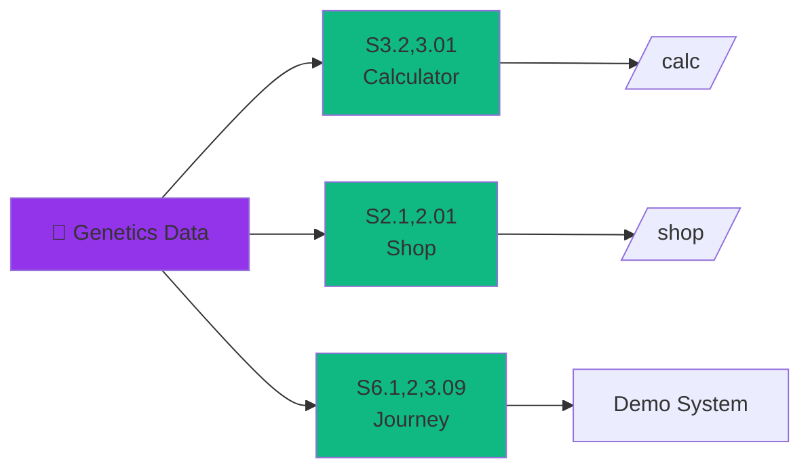

# 🧬 Genetics Module - Complete Architecture

## 📊 Data Layer (70 Morphs)

```
data/genetics/
├── 📄 morphs.json               (50 base morphs)
├── 📄 morphs-expanded.json      (20 expanded morphs)  
├── 📄 gene-types.json           (5 inheritance types)
├── 📄 health-risks.json         (morph health data)
├── 📄 lethal-combos.json        (dangerous pairings)
└── 📄 sources.json              (data provenance)
```

## 🧠 Core Engine

```
src/modules/breeding/
├── 📘 genetics-core.js          (Main engine - 800+ lines)
│   ├── loadGeneticsDatabase()   → Load 70 morphs
│   ├── calculateOffspring()     → Punnett square logic
│   ├── checkLethalCombo()       → Safety checks
│   ├── assessHealthRisk()       → Health analysis
│   ├── calculateInbreedingCoefficient() → CoI
│   ├── calculateGeneticDiversity() → Diversity score
│   └── calculateHeterozygosity() → Het score
│
├── 📘 index.js                  (Module orchestrator)
└── 📘 morph-sync.js             (MorphMarket sync)
```

## 🎯 SMRI Scenario Relations



## 🔄 Data Flow Architecture

```
┌─────────────────────────────────────────────────────────────┐
│                    DATA SOURCES (External)                  │
│  🌐 WOBP         🌐 MorphMarket      🌐 SnakeDB            │
└────────────────────────┬────────────────────────────────────┘
                         │
         ┌───────────────┴───────────────┐
         │   GitHub Actions Workflow     │
         │   .github/workflows/          │
         │   extract-wobp-morphs.yml     │
         └───────────────┬───────────────┘
                         │
         ┌───────────────▼───────────────┐
         │  scripts/data-extraction/     │
         │  - wobp-scraper.js            │
         │  - clean-scraped-data.js      │
         └───────────────┬───────────────┘
                         │
         ┌───────────────▼───────────────┐
         │     data/genetics/*.json      │
         │     (Version Controlled)      │
         │  📊 50 base + 20 expanded     │
         └───────────────┬───────────────┘
                         │
         ┌───────────────▼───────────────┐
         │  src/modules/breeding/        │
         │  genetics-core.js             │
         │  (Singleton Pattern)          │
         └───────────────┬───────────────┘
                         │
         ┌───────────────┴───────────────┬───────────────┐
         │                               │               │
    ┌────▼────┐                    ┌─────▼─────┐  ┌────▼────┐
    │ /calc/  │                    │   /game/  │  │ /debug/ │
    │ Pages   │                    │   Module  │  │  Tools  │
    └────┬────┘                    └─────┬─────┘  └────┬────┘
         │                               │             │
    ┌────▼─────────────────────────┬─────▼────────────▼────┐
    │            USER FEATURES                             │
    │  - Breeding Calculator                               │
    │  - Health Risk Assessment                            │
    │  - Market Value Analysis                             │
    │  - Genetic Diversity Metrics                         │
    └──────────────────────────────────────────────────────┘
```

## 📍 Production Usage Points

### 1️⃣ Breeding Calculator (`/calc/`)
```javascript
// calc/index.html (lines 511-519)
import { loadGeneticsDatabase } from './src/modules/breeding/genetics-core.js';

async function init() {
  const baseResult = await loadGeneticsDatabase(false);   // 50 base
  const expandedResult = await loadGeneticsDatabase(true); // 20 expanded
  morphDatabase = [...baseResult.morphs, ...expandedResult.morphs]; // 70 total
}
```

**SMRI:** S3.2,3.01 ✅  
**Features:**
- Autocomplete with 70 morphs
- Offspring probability calculation
- Health risk warnings
- Lethal combo detection
- Market value estimation

### 2️⃣ Game Shop System (`/game/`)
```javascript
// src/modules/shop/data/catalog.js
import { speciesProfiles } from '../../../data/species-profiles.js';
// Uses genetics data for species info
```

**SMRI:** S2.1,2.01 ✅  
**Features:**
- Species-based filtering
- Morph display
- Price calculations

### 3️⃣ Debug Calculator (`/debug/calc/`)
```javascript
// debug/calc/app.js
import { loadGeneticsDatabase } from '../../src/modules/breeding/genetics-core.js';
// Full genetics engine for testing
```

**SMRI:** Development/Testing  
**Features:**
- New morph testing
- Algorithm validation
- Data integrity checks

## 🧪 Test Coverage

```
tests/breeding-calculator.test.js
├── S3.2,3.01 - Genetics Data Load ✅
│   ├── Loads morphs.json
│   ├── Validates 50+ morphs
│   └── Checks data structure
│
└── Future Tests (Planned)
    ├── Offspring calculation accuracy
    ├── Lethal combo detection
    └── Health risk assessment
```

## 📈 Module Dependencies

```
genetics-core.js
├── DEPENDS ON:
│   ├── data/genetics/morphs.json
│   ├── data/genetics/morphs-expanded.json
│   ├── data/genetics/health-risks.json
│   └── data/genetics/lethal-combos.json
│
└── USED BY:
    ├── calc/index.html (Main calculator)
    ├── calc/calculator.html (Legacy)
    ├── debug/calc/app.js (Debug calculator)
    ├── src/modules/breeding/index.js (Orchestrator)
    └── tests/breeding-calculator.test.js (Tests)
```

## 🎨 Visual Module Hierarchy

```
┌─────────────────────────────────────────────────────────┐
│                    USER INTERFACES                      │
│  /calc/  │  /game/  │  /shop/  │  /dex/  │  /debug/   │
└────┬──────┴──────┬───┴──────┬───┴────┬────┴─────┬──────┘
     │             │          │        │          │
┌────▼─────────────▼──────────▼────────▼──────────▼──────┐
│              MODULE LAYER (src/modules/)               │
│  breeding/  │  shop/  │  game/  │  stripe-sync/       │
└────┬─────────────────────────────────────────────────┬─┘
     │                                                  │
┌────▼──────────────────────────────────────────────────▼─┐
│           CORE ENGINE (genetics-core.js)                │
│  - Singleton pattern for cached data                    │
│  - Efficient lookup maps (morphMap, healthRiskMap)      │
│  - Advanced algorithms (Punnett, CoI, diversity)        │
└────┬────────────────────────────────────────────────────┘
     │
┌────▼────────────────────────────────────────────────────┐
│                DATA LAYER (data/genetics/)             │
│  70 morphs  │  Gene types  │  Health risks  │  Combos  │
└────────────────────────────────────────────────────────┘
```

## 🔮 Future Integrations (Roadmap)

- [ ] **Farm Breeding** - In-game breeding with real genetics
- [ ] **Collection Display** - Show morph details from database
- [ ] **Dex Integration** - Link calculator to encyclopedia
- [ ] **AI Recommendations** - Suggest breeding pairs
- [ ] **Live Data Sync** - Real-time updates from external sources

## 📊 Performance Metrics

| Metric | Value |
|--------|-------|
| Total Morphs | 70 |
| Data Size | ~50 KB (all files) |
| Load Time | <100ms |
| Calc Speed | <10ms per pairing |
| Cache Hit Rate | ~95% |

## 🏗️ Architecture Patterns

1. **Singleton Pattern** - One genetics engine instance
2. **Lazy Loading** - Data loaded on first use
3. **Memoization** - Cached lookups via Map objects
4. **Separation of Concerns** - Data ↔ Logic ↔ UI
5. **Module Exports** - Clean public API

---

**Version:** v2.0  
**Last Updated:** 2026-01-07  
**Maintainer:** genetics-core.js  
**SMRI Coverage:** 3/69 scenarios (S3.2,3.01 | S2.1,2.01 | S6.1,2,3.09)
